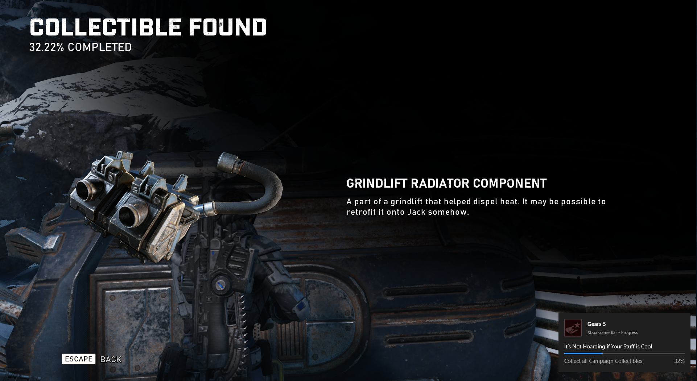

# Achievement Watcher — Fixed Edition

A fork of [Darktakayanagi's Achievement Watcher][dtk] (itself a fork of
[xan105's original][xan]) that fixes the two issues which make achievements
**silently stop working with the current Goldberg / gbe_fork Steam emulator** —
so that a normal user who just installs it doesn't run into them.

> 🇵🇱 **Po polsku:** to wersja Achievement Watcher z naprawionymi błędami przez
> które osiągnięcia z nowego Goldberga (gbe_fork, folder `GSE Saves`) **nie
> pokazują się ani w grze, ani w trackerze**. Po instalacji wystarczy raz wkleić
> darmowy klucz Steam API i odpalić dołączone narzędzie `goldberg-ach-fix` na grze.
> Szczegóły niżej i w [FIXES.md](FIXES.md).



---

## What was broken, and what this fork fixes

There are **two separate failures**. The first lives in Achievement Watcher and
is fixed here in source; the second lives in the game's emulator files and is
fixed by the bundled tool. See [FIXES.md](FIXES.md) for the full write-up.

### Fix 1 — Games stuck on a permanent blacklist (fixed in source)

Upstream Achievement Watcher adds an appid to its blacklist (`cfg/exclusion.db`)
the **first time** a game's schema fails to load — including for purely transient
reasons: no Steam Web API key set yet, a network hiccup, a rate-limit, the schema
CDN being momentarily down. Once blacklisted, the game is **silently skipped on
every future scan**, even after you fix the key or network. It never comes back,
with no message explaining why.

This is the single most confusing failure for new users: they set everything up
correctly, but a game they opened *before* configuring the API key is now
invisible forever.

**Fixed:** a failed load no longer blacklists the game — it's simply retried on
the next scan. Genuinely unwanted appids are still handled by the built-in
bogus-list, the server list, and the manual "blacklist" action in the UI.
(`app/parser/achievements.js`)

### Fix 2 — New Goldberg/gbe_fork games show up empty or without icons (bundled tool)

The current Goldberg fork, **gbe_fork**, needs a `steam_settings/achievements.json`
inside the game that defines the achievements using their **real Steam API names**
(e.g. `ACH_TOGETHER_AGAIN`) plus local icons. Many repacks ship this file missing,
empty, or with **made-up names** (e.g. `the_whole_sick_crew`) and **no icons**.

When that happens, the game calls `SetAchievement("ACH_TOGETHER_AGAIN")`, the
emulator doesn't recognise the name, and the unlock is **silently dropped** — so
nothing pops in-game and nothing is written to your save for any tracker to read.

Achievement Watcher itself can't fix this, because the broken data is on the game
side. The bundled [`tools/goldberg-ach-fix`](tools/goldberg-ach-fix) repairs it:
it fetches the real schema from Steam and writes a correct `achievements.json`
(proper names + downloaded icons + recovered descriptions) into the game.

> Note: Achievement Watcher **already parses** gbe_fork's `earned` / `earned_time`
> save format correctly — that part was never broken. The problem is upstream of
> it, in the emulator's own schema file.

### Fix 3 — games with hidden achievements crash out of the list (fixed in source)

`GetMissingData()` in `app/parser/steam.js` tried to enrich blank descriptions
(which the Steam schema legitimately leaves empty for **hidden** achievements) via
a "steamhunters" lookup, then called `.map()` on the response without checking it.
For obscure titles that lookup returns nothing, so `.map of undefined` threw and
**aborted the game's load — it vanished from the list** despite a valid schema and
save. Now the supplemental response is guarded. (Hit this on ZERO PARADES: 42/55
achievements have blank descriptions.) See [FIXES.md](FIXES.md#fix-3).

## Quick start (so you don't hit these problems)

1. **Install** this build (see *Building* below) or the upstream app.
2. **Add a free Steam Web API key:** get one at
   <https://steamcommunity.com/dev/apikey>, then paste it in
   *Settings → Steam → API key*. Do this **before** opening emulated games so they
   resolve on the first try. (With Fix 1, opening one early is no longer fatal —
   it'll resolve once the key is set and the game is rescanned.)
3. **For each emulated game, repair its schema once** so in-game pop-ups and icons
   work:
   ```bash
   cd tools/goldberg-ach-fix
   node bin/achfix.js fix --game "C:\Games\<Your Game>" --key <YOUR_KEY>
   ```
   This also un-blacklists the game in Achievement Watcher and restarts it.
4. Launch the game and unlock something — it now pops in-game **and** appears in
   the tracker.

### Already have games wrongly blacklisted?

If you ran the upstream app before, some games may already be stuck. Either:
- run `goldberg-ach-fix fix` on the game (it un-blacklists that appid), or
- *Settings → Advanced → Reset blacklist* in the app, or
- delete `%APPDATA%\Achievement Watcher\cfg\exclusion.db`.

## Bundled tool: goldberg-ach-fix

A small zero-dependency Node 18+ CLI. Full docs in
[tools/goldberg-ach-fix/README.md](tools/goldberg-ach-fix/README.md).

```text
achfix fix   --game <path> [--appid <id>] [--key <steamWebApiKey>]   # repair a game's schema + icons
achfix watch                                                          # desktop toast on every unlock
achfix list  --game <path>                                            # show unlock progress
```

## Building

This is an Electron app. From a clone:

```bash
cd app        && npm install
cd ../watchdog && npm install
cd ../app     && npm run build   # electron-builder -> installer in dist/
```

To run without packaging: `cd app && npm install && npm start`.

The heavy build artifacts, the NW/Electron runtime, the prebuilt installers and
the docs/screenshots from upstream are **not** vendored in this repo (they're
fetched/produced by the build). Only the source is tracked.

## Credits & license

This is a community fork. All credit for Achievement Watcher goes to:

- **[Xan105](https://github.com/xan105/Achievement-Watcher)** — original author.
- **[Darktakayanagi](https://github.com/darktakayanagi/Achievement-Watcher)** —
  the fork this builds on (v2.0+).

Achievement Watcher is licensed under **LGPL-3.0** — see [LICENSE](LICENSE) and
[NOTICE.md](NOTICE.md), both preserved unchanged. The fixes in this fork are
released under the same license. The bundled `tools/goldberg-ach-fix` is
independently licensed under MIT (see its own LICENSE file).

Not affiliated with Valve, Goldberg, or gbe_fork. Use only with games you own.

[xan]: https://github.com/xan105/Achievement-Watcher
[dtk]: https://github.com/darktakayanagi/Achievement-Watcher
